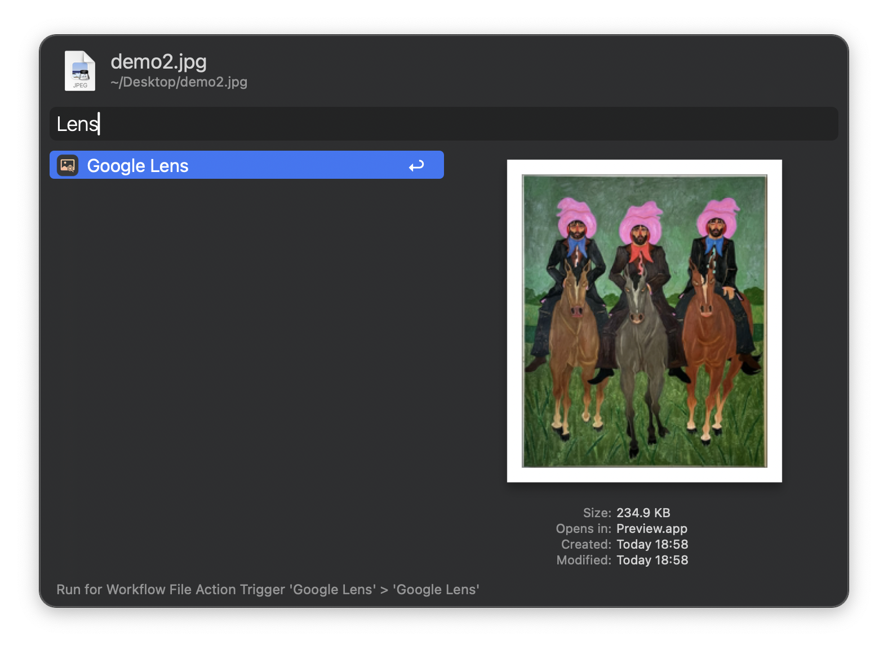

# Google Lens for Alfred

A seamless Google Lens image search workflow for [Alfred](https://alfred.app/). You can search via screenshot or selected images. The results will be displayed in your browser.

## Installation

[⤓ Download](https://github.com/svenko99/alfred-google-lens/releases/latest/download/Google.Lens.alfredworkflow) the workflow from the repository.

## Example

